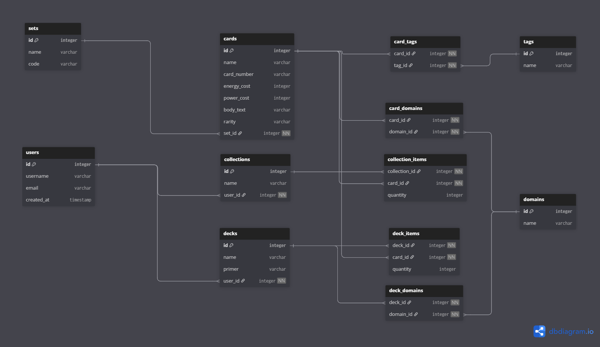

# App Specification – Riftforge

## 1. General Information
- **Project name:** Riftforge
- **Platforms:** Android and iOS
- **App type:** Mobile client + backend
- **Main objective:** Allow users to create collections and decks from Riftbound cards, consult prices and explorer cards using search and filter parameters.

---

## 2. Secondary objective
- Fluid and consistent on Android and iOS.
- Scan cards with camera to identify and add to collection automatically.
- Integration with Cardmarket or other price provider APIs with cache on backend.

---

## 3. Main Functionalities

| Functionality | Description |
|---------------|------------|
| Card catalogue | Search by name, domains, type, rarity, set; combinable filters. |
| User collections | Add/remove cards, see quantity, collection management. |
| Decks | Create, edit, remove decks; add/remove cards from decks. |
| Scan cards | Take photos → backend identifies card using OCR or other tool. |
| Prices | Consult external prices on Cardmarket or other pricing webpages, cache results. |
| Authentication | Usder regitry, login, secure sessions management. |

---

## 4. Technical requirements

### 4.1 Frontend
- Flutter (Dart)
- State: Riverpod
- HTTP/Networking: dio
- Serialization: freezed + json_serializable

### 4.2 Backend
- Django + Django REST Framework
- Database: PostgreSQL
- Cache: Redis
- Authentication: JWT (access + refresh)

### 4.3 Infraestructura
- Docker (DB + Redis + backend)
- CI/CD: GitHub Actions

---

## 5. Main database model

---

## 6. Endpoints API (examples)

| Method | Endpoint | Description |
|--------|---------|-------------|
| GET | /cards?search=&type=&rarity= | List cards with filters |
| GET | /cards/:id | Card detail |
| GET | /collections | List user collections |
| GET | /collections/:id | Collection detail |
| POST | /collections/:collection_id/add/:card_id | Add card to collection |
| GET | /decks | List user decks |
| POST | /decks | Create or edit decks |
| POST | /scan-card | Process image and return scanned card |

---

## 7. App flow (visual simplificado)
[User]
|
v
[Client: Flutter]
|
| HTTP
v
[Backend: Django + DRF] <-- Camera scan
|
v
[Database/cache: PostgreSQL + Redis]
^
|
External APIs (prices)

---

## 8. UI/UX requirements
- LIsts and grids for cards, collections and decks.
- Clear forms for collections and decks.
- Combinable filters with ordering.
- Visual fedback for errors and actions.
- Swift interaction with minimum latency.

---

## 9. Extras/Future improvements
- Advanced integrations with pricing APIs.
- Export/Import of decks in standard format for Riftbound.

---

## 10. Deployment and infrastructure

| Component | Tool/Stack |
|------------|------------------|
| Backend | Django + DRF |
| Database | PostgreSQL |
| Cache / Jobs | Redis |
| Containers | Docker (DB + Redis + backend) |
| CI/CD | GitHub |
| Mobile | Flutter (Dart) |
| Android support | Android Studio (emulador + SDK) |
| iOS support | Xcode (simulador + firma) |
